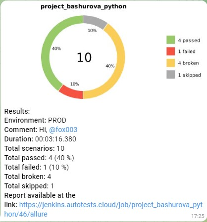

# Дипломный проект по автоматизации тестирования 
> <a target="_blank" href="https://www.officemag.ru/">UI тесты</a>
> <a target="_blank" href="https://demowebshop.tricentis.com/">Api тесты</a>

#### Список проверок, реализованных в UI автотестах
- [x] Проверка наличия категорий товаров
- [x] Проверка акционных товаров
- [x] Проверка товаров участвующих в распродаже
- [x] Проверка поиска товаров через поисковую строку

#### Список проверок, реализованных в API автотестах
- [x] Проверка успешной авторизации
- [x] Проверка добавления товара в козину
- [x] Проверка неудачного добавления товара в корзину
- [x] Проверка поиска товара
- [x] Проверка отправки емайл

### Структура проекта

### Проект реализован с использованием
Python Pytest Selene Jenkins Selenoid Jira Allure reports Allure TestOps Telegram 

<p  align="center">
  <code></code>
  <code></code>
  <code></code>
  <code></code>
  <code></code>
  <code></code>
  <code></code>
  <code></code>
  <code></code>
</p>

<!-- Jenkins -->
----
# Запуск автотестов выполняется на сервере Jenkins
##  Запуск автотестов в Jenkins
## [Jenkins](https://allure.autotests.cloud/project/4080/dashboards)
#### 1. Открыть <a target="_blank" href="https://jenkins.autotests.cloud/job/project_bashurova_python">проект</a>


#### 2. Выбрать пункт **Собрать с параметрами**
#### 3. В случае необходимости изменить параметры, выбрав значения из выпадающих списков
#### 4. Нажать **Собрать**
#### 5. Результат запуска сборки можно посмотреть в отчёте Allure-testops

##  Отчет в Allure-testops
## [Allure-testops](https://allure.autotests.cloud/project/4080/dashboards)


----
# Локальный запуск

1. Скачайте репозиторий себе на компьютер
2. Создайте и активируйте виртуальное окружение
  ```bash
  python -m venv .venv
  source .venv/bin/activate
  ```
3. Установите зависимости с помощью pip
  ```bash
  pip install -r requirements.txt
  ```
4. Для запусков тестов локально используйте команды:
  ```bash
  pytest -sv -m web
  pytest -sv -m api
  ```
Получение отчёта allure:
```bash
allure/bin/allure.bat serve tests/api/allure-results
```
### Результаты тестов в Allure report
  

<!-- Jira -->
----
##  Создание задачи в Jira
## [Ссылка на задачу](https://jira.autotests.cloud/browse/HOMEWORK-1138)
 

<!-- Allure report -->
----
##  Просмотр отчета по пройденным автотестам Allure Report
## [Ссылка на отчет](https://jenkins.autotests.cloud/job/project_bashurova_python/48/allure/)
### Результаты тестов в Allure report
  

### Пример видеозаписи прохождения теста


<!-- Telegram -->
----
##  Отчет в Telegram

### Уведомление в Telegram bot после прохождения тестов

